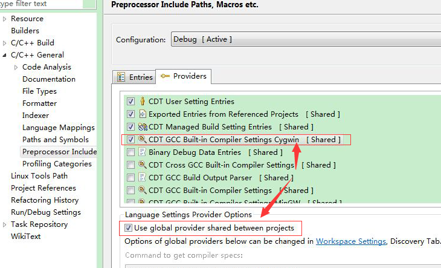
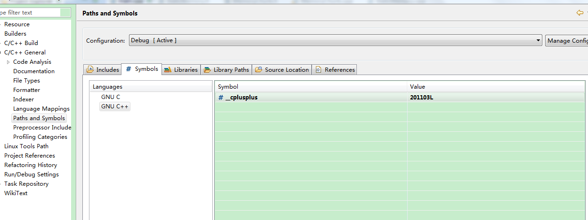
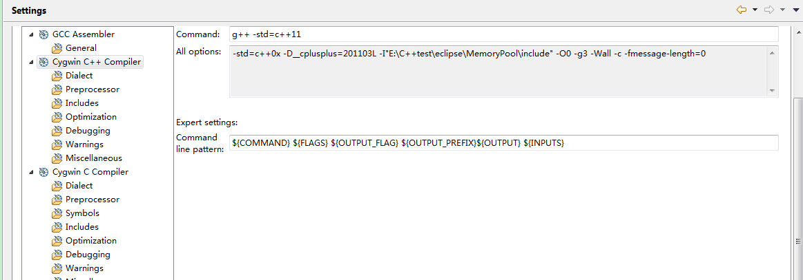
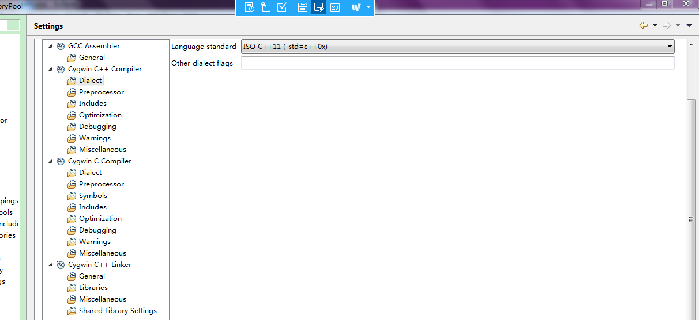

To setup CDT with cygwin, following below steps.

1.Project -> Properties -> C/C++ General -> Preprocessor Include,
select CDT GCC Built-in Compiler Settings Cygwin, check "Use global provider shared between projects".



2.Project -> Properties -> C/C++ General -> Paths and Symbols,
select Symbols -> GNU C++, add following Symbol

```
_cplusplus
```

with value:

```
201303L
```



3.Project -> Properties -> C/C++ Build -> Settings, select Cygwin C++ Compiler. Change command to

```
g++ -std=c++11
```



4.Project -> Properties -> C/C++ Build -> Settings, select Cygwin C++ Commpiler -> Dialect, Select ISO C++11 (-std=c++0x).


